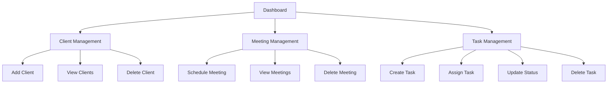

# OfficeFlow – Internal Office Coordination System

[](https://www.python.org/)
[](https://flask.palletsprojects.com/)
[](https://www.sqlite.org/)

OfficeFlow is a lightweight, web-based internal office coordination system designed to simplify everyday office activities such as managing clients, scheduling meetings, and tracking tasks. 

## ✨ Features

### 📊 Dashboard
- **Overview:** View the total number of clients, meetings, and tasks at a glance.
- **Quick Access:** Seamless navigation to different modules.
- **User-Friendly:** Simple and clean interface for an enhanced user experience.

### 👥 Client Management
- **Add Clients:** Easily add new client information to the system.
- **View Records:** Access a comprehensive list of client records.
- **Store Details:** Keep track of company details, contact information, and client status.
- **Manage Data:** Delete client records securely when required.

### 📅 Meeting Management
- **Schedule:** Plan and schedule meetings with specific clients.
- **Track Time:** Store precise meeting dates and times.
- **Categorize:** Select the type of meeting (e.g., Online, In-Person).
- **Details:** Add participants and define the meeting agenda.
- **Status Tracking:** Monitor meeting statuses (Scheduled, Completed, Cancelled).

### ✅ Task Management
- **Create Tasks:** Generate and manage daily office tasks.
- **Assign:** Allocate tasks to respective team members.
- **Deadlines:** Set strict due dates to ensure timely completion.
- **Prioritize:** Set task priorities (High, Medium, Low).
- **Progress:** Update and track task statuses dynamically.

## 🛠 Technologies Used

- **Frontend:** HTML5, CSS3, Vanilla JavaScript
- **Backend:** Python, Flask, Flask-CORS
- **Database:** SQLite
- **Architecture:** RESTful APIs

## 📂 Project Structure

```text
OfficeFlow/
├── app.py                # Main Flask application and API routes
├── database.py           # Database connection and table creation logic
├── requirements.txt      # Python dependencies
├── README.md             # Project documentation
├── .gitignore            # Ignored files for Git
│
├── templates/            # HTML templates
│   ├── index.html        # Dashboard
│   ├── clients.html      # Client Management
│   ├── meetings.html     # Meeting Management
│   └── tasks.html        # Task Management
│
└── static/               # Static assets
    ├── css/
    │   └── style.css     # Global styles
    └── js/
        ├── dashboard.js  # Dashboard logic
        ├── clients.js    # Client management logic
        ├── meetings.js   # Meeting management logic
        └── tasks.js      # Task management logic
```

## 🚀 How to Run the Project

Follow these steps to set up and run the project locally.

**1. Clone the Repository**
```bash
git clone https://github.com/Rajashree185/OfficeFlow.git
cd OfficeFlow
```

**2. Create a Virtual Environment**
```bash
python -m venv venv
```

**3. Activate the Virtual Environment**
- On **Windows**:
  ```cmd
  venv\Scripts\activate
  ```
- On **macOS/Linux**:
  ```bash
  source venv/bin/activate
  ```

**4. Install Dependencies**
```bash
pip install -r requirements.txt
```

**5. Run the Application**
```bash
python app.py
```
*The database is automatically initialized when the Flask application starts for the first time.*

**6. Access the Application**
Open your preferred web browser and navigate to:
```text
http://127.0.0.1:5000/
```

## 🔄 Application Workflow



## 🗄 Database

OfficeFlow utilizes **SQLite** for robust and lightweight data storage. The database schema includes three main tables:
- `Clients`
- `Meetings`
- `Tasks`

## 🔌 REST API Endpoints

The backend provides structured REST API endpoints for seamless frontend-backend communication.

### Client APIs
| Method | Endpoint | Description |
|--------|----------|-------------|
| `GET` | `/api/clients` | Retrieve all clients |
| `POST` | `/api/clients` | Add a new client |
| `DELETE` | `/api/clients/<id>` | Delete a specific client |

### Meeting APIs
| Method | Endpoint | Description |
|--------|----------|-------------|
| `GET` | `/api/meetings` | Retrieve all meetings |
| `POST` | `/api/meetings` | Schedule a new meeting |
| `DELETE` | `/api/meetings/<id>` | Delete a specific meeting |

### Task APIs
| Method | Endpoint | Description |
|--------|----------|-------------|
| `GET` | `/api/tasks` | Retrieve all tasks |
| `POST` | `/api/tasks` | Create a new task |
| `PUT` | `/api/tasks/<id>` | Update a specific task |
| `DELETE` | `/api/tasks/<id>` | Delete a specific task |

## 🎯 Purpose

OfficeFlow was developed as a practical full-stack project to demonstrate:
- Web application development using Flask
- Frontend and backend integration
- RESTful API design and development
- SQLite database management and CRUD operations
- JavaScript-based DOM manipulation and API interaction
- Clean and responsive UI design principles

## 🔮 Future Improvements

Potential features for future releases:
- 🔒 **User Authentication & Authorization:** Role-based access control (Admin, Employee).
- 🔍 **Advanced Search & Filtering:** Quickly locate clients, meetings, and tasks.
- 🔔 **Notifications & Reminders:** Email or in-app alerts for upcoming meetings/tasks.
- 📈 **Reporting:** Generate and export data reports (CSV/PDF).
- 🔗 **Integrations:** Sync with external productivity tools like Google Calendar.

## 👨‍💻 Author

**Rajashree Ray**
*Computer Science & Engineering Student*